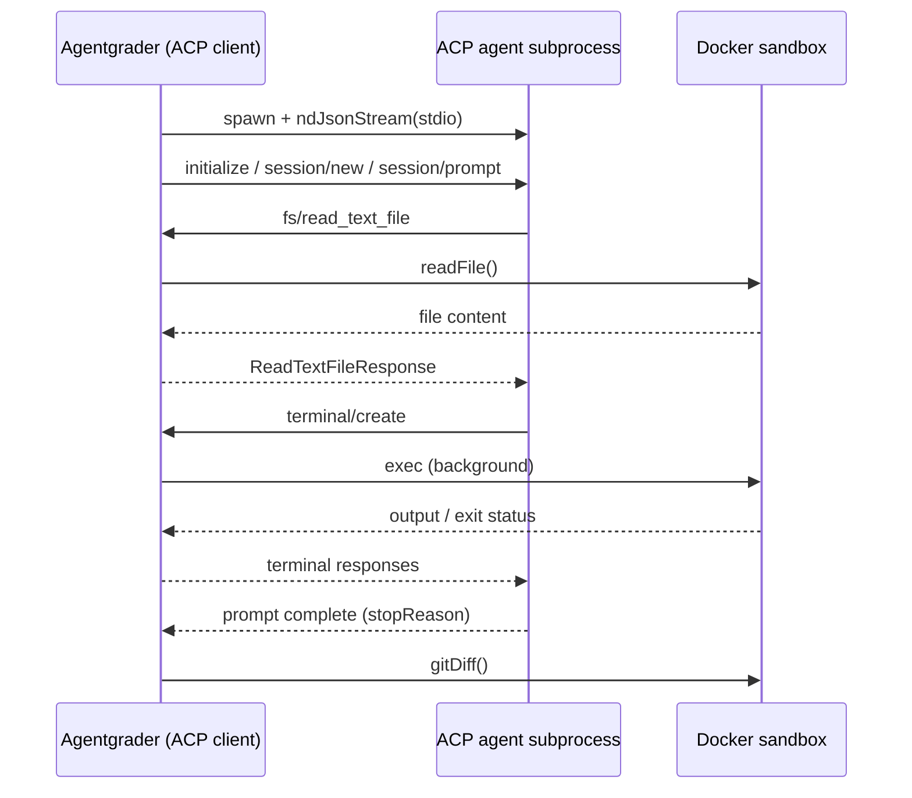

# ACP Agent Adapter

Agentgrader can benchmark any [Agent Client Protocol (ACP)](https://agentclientprotocol.com/) compatible coding agent (Claude Code, Cursor Agent, Gemini CLI, and others) without writing a custom adapter.

The `@agentgrader/agent-acp` package implements `AcpAgentAdapter`. Agentgrader acts as the **ACP client**: it spawns the agent as a subprocess, talks JSON-RPC 2.0 over stdio via `@agentclientprotocol/sdk`, and routes file and terminal tool calls into the Docker sandbox.

## How it works

Click the sequence diagram to zoom and inspect each step.



The ACP agent process runs on the **host** (where you invoke `agr`). Sandbox isolation is preserved because every filesystem and terminal operation the agent requests is forwarded to `SandboxHandle` inside the container. Session paths use `acp_cwd` (default `/app`, matching the Docker sandbox working directory).

Permission prompts (`session/request_permission`) are auto-approved so benchmarks can run unattended in CI.

## Install

The ACP adapter ships with the CLI from Agentgrader 1.3+. For programmatic use:

::: code-group

```bash [npm]
npm install @agentgrader/agent-acp @agentgrader/core @agentgrader/sandbox-docker
```

```bash [bun]
bun add @agentgrader/agent-acp @agentgrader/core @agentgrader/sandbox-docker
```

:::

You must also install the external ACP agent binary you want to benchmark (for example `claude` with ACP mode, or `cursor-agent`) and ensure it is on your `PATH`.

## Agent config

Add ACP fields to `agent.yaml`. The `model` field is still required by the schema but is not used by the ACP adapter; set it to `acp` as a placeholder.

```yaml
name: Claude Code (ACP)
model: acp
max_steps: 30
step_timeout_ms: 300000
acp_command: claude
acp_args:
  - --acp
acp_cwd: /app
```

| Field | Description |
|---|---|
| `acp_command` | Executable name or path for the ACP agent. If `acp_args` is omitted, a single string is split on whitespace (e.g. `cursor-agent acp`). |
| `acp_args` | Optional argument list passed to `acp_command`. |
| `acp_cwd` | Working directory forwarded to `session/new` (default `/app`). |
| `acp_env` | Optional map of extra environment variables for the spawned subprocess. |
| `step_timeout_ms` | Aborts the prompt turn if the agent stalls (default `120000`). |

Ready-made examples live in the main repository under `examples/configs/agent-acp-claude.yaml` and `examples/configs/agent-acp-cursor.yaml`.

## CLI

Select the adapter explicitly; the default remains the AI SDK / OpenRouter adapter (`ai-sdk`).

```bash
agr run tasks/hello-world/agr.yaml \
  --config examples/configs/agent-acp-claude.yaml \
  --adapter acp

agr bench \
  --suite examples/suites/typescript-bugs \
  --configs examples/configs/agent-acp-claude.yaml \
  --adapters acp
```

Compare the built-in LLM loop against an external ACP agent in one bench run:

```bash
agr bench \
  --suite test-cases/ \
  --configs agent.yaml,examples/configs/agent-acp-claude.yaml \
  --adapters ai-sdk,acp
```

## Programmatic API

```typescript
import { runSingle } from "@agentgrader/core";
import { AcpAgentAdapter } from "@agentgrader/agent-acp";
import { DockerSandboxProvider } from "@agentgrader/sandbox-docker";

const result = await runSingle({
  testCase,
  agentConfig: {
    name: "claude-acp",
    model: "acp",
    max_steps: 30,
    acp_command: "claude",
    acp_args: ["--acp"],
    acp_cwd: "/app",
  },
  adapter: new AcpAgentAdapter(),
  sandboxProvider: new DockerSandboxProvider(),
  runId: crypto.randomUUID(),
});

console.log(result.passed, result.finalDiff);
```

For cross-adapter matrices, pass multiple adapters to `runBenchmark()`:

```typescript
import { AcpAgentAdapter } from "@agentgrader/agent-acp";
import { AiSdkAgentAdapter } from "@agentgrader/agent-openrouter";

await runBenchmark({
  testCases,
  agentConfigs,
  adapters: [new AiSdkAgentAdapter(), new AcpAgentAdapter()],
  sandboxProvider,
});
```

## Tool routing

| ACP client method | Sandbox |
|---|---|
| `fs/read_text_file` | `sandbox.readFile()` |
| `fs/write_text_file` | `sandbox.writeFile()` |
| `terminal/create` | background `sandbox.exec()` |
| `terminal/output`, `terminal/wait_for_exit`, `terminal/kill`, `terminal/release` | poll/kill temp files in the container |
| `session/request_permission` | auto-approve first allow option |

Session updates (`tool_call`, `agent_message_chunk`, etc.) are mapped to `StepEvent` traces for `agr trace` and the live run UI.

## Completion and errors

When the agent finishes a prompt turn, `AcpAgentAdapter` calls `sandbox.gitDiff()` and returns `finished: true` if `stopReason` is `end_turn`. Other stop reasons (`cancelled`, `max_tokens`, etc.) set `finished: false` and populate `AgentResult.error`, surfaced as `agent error:` in `agr trace`.

If you need a different agent integration (custom auth, non-stdio transport, proprietary tools), implement your own adapter; see [Custom Agent Adapter](/advanced/custom-adapter).
