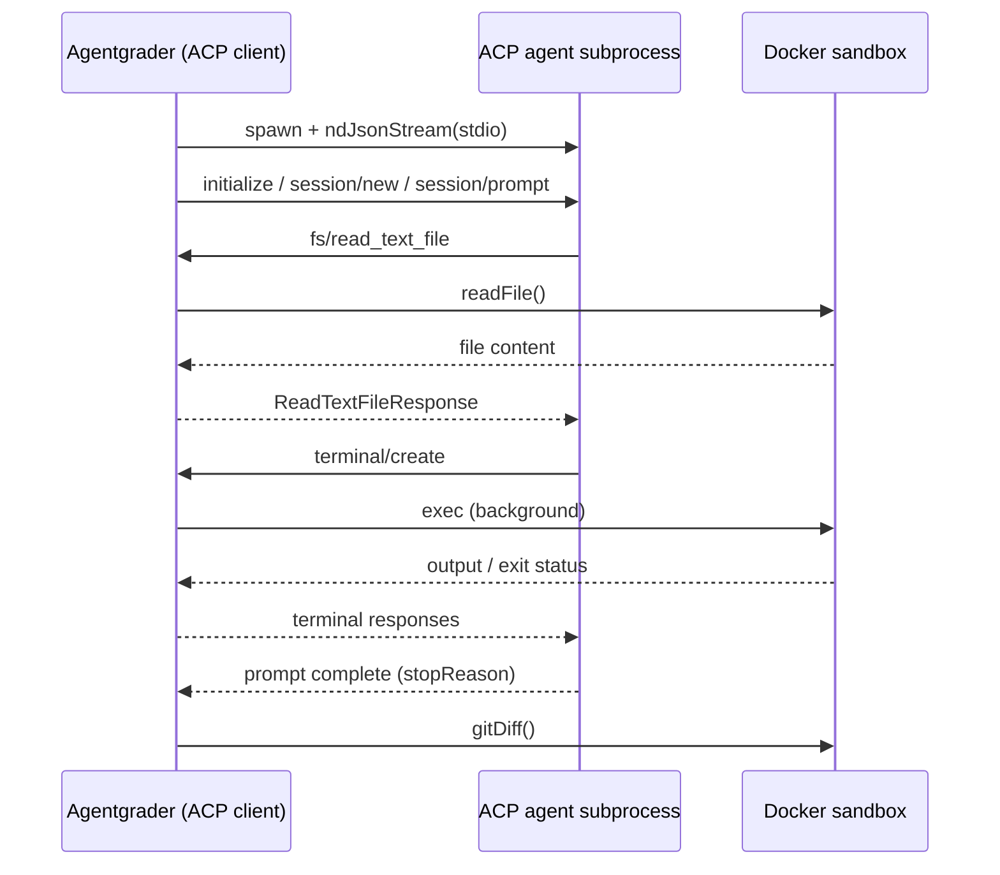

# ACP Agent Adapter

Agentgrader can benchmark any [Agent Client Protocol (ACP)](https://agentclientprotocol.com/) compatible coding agent (Claude Code, Cursor Agent, Gemini CLI, and others) without writing a custom adapter.

The `@agentgrader/agent-acp` package implements `AcpAgentAdapter`. Agentgrader acts as the **ACP client**: it spawns the agent as a subprocess, talks JSON-RPC 2.0 over stdio via `@agentclientprotocol/sdk`, and routes file and terminal tool calls into the Docker sandbox.

## How it works

Click the sequence diagram to zoom and inspect each step.



The ACP agent process runs on the **host** (where you invoke `agr`). Sandbox isolation is preserved because every filesystem and terminal operation the agent requests is forwarded to `SandboxHandle` inside the container. Session paths use `acp_cwd` (default `/app`, matching the Docker sandbox working directory).

Permission prompts (`session/request_permission`) are auto-approved so benchmarks can run unattended in CI.

## Install

The ACP adapter ships with the CLI from Agentgrader 1.3+. For programmatic use:

::: code-group

```bash [npm]
npm install @agentgrader/agent-acp @agentgrader/core @agentgrader/sandbox-docker
```

```bash [bun]
bun add @agentgrader/agent-acp @agentgrader/core @agentgrader/sandbox-docker
```

:::

You must also install the external ACP agent binary you want to benchmark (for example `claude` with ACP mode, or `cursor-agent`) and ensure it is on your `PATH`.

## Agent config

Add ACP fields to `agent.yaml`. The `model` field is still required by the schema but is not used by the ACP adapter; set it to `acp` as a placeholder.

```yaml
name: Claude Code (ACP)
model: acp
max_steps: 30
step_timeout_ms: 300000
acp_command: claude
acp_args:
  - --acp
acp_cwd: /app
```

| Field | Description |
|---|---|
| `acp_command` | Executable name or path for the ACP agent. If `acp_args` is omitted, a single string is split on whitespace (e.g. `cursor-agent acp`). |
| `acp_args` | Optional argument list passed to `acp_command`. |
| `acp_cwd` | Working directory forwarded to `session/new` (default `/app`). |
| `acp_env` | Optional map of extra environment variables for the spawned subprocess. |
| `step_timeout_ms` | Aborts the prompt turn if the agent stalls (default `120000`). |

Ready-made examples live in the main repository under `examples/configs/agent-acp-claude.yaml` and `examples/configs/agent-acp-cursor.yaml`.

## CLI

Select the adapter explicitly; the default remains the AI SDK / OpenRouter adapter (`ai-sdk`).

```bash
agr run tasks/hello-world/agr.yaml \
  --config examples/configs/agent-acp-claude.yaml \
  --adapter acp

agr bench \
  --suite examples/suites/typescript-bugs \
  --configs examples/configs/agent-acp-claude.yaml \
  --adapters acp
```

Compare the built-in LLM loop against an external ACP agent in one bench run:

```bash
agr bench \
  --suite test-cases/ \
  --configs agent.yaml,examples/configs/agent-acp-claude.yaml \
  --adapters ai-sdk,acp
```

## Using `toolkits` with ACP agents

`toolkits:` (on the agent config or the test case) work the same way for
ACP agents as for the built-in AI SDK loop: the sandbox is set up *before*
either adapter runs, so a toolkit's `bin/` scripts are already on `PATH` and
its `.claude/skills/*/SKILL.md` files are already in `/app/.claude/skills/`
by the time the ACP agent's prompt turn starts.

If a toolkit ships a `setup.sh` at its root, it also runs once during this
same sandbox-setup phase, before either adapter's prompt turn starts - use
it to install dependencies the toolkit's scripts (or the agent's own ad-hoc
commands) need, e.g. `pip install pytest` on a bare `python:3.11` image. See
[Best Practices](/guide/best-practices#toolkit-setup-hooks-setup-sh).

A ready-made example combining both fields lives at
`examples/configs/agent-acp-claude-with-toolkit.yaml`: it adds `toolkits:
[../toolkits/code-search]` to the same `acp_command: claude` setup as
`agent-acp-claude.yaml` above.

```bash
agr run tasks/hello-world/agr.yaml \
  --config examples/configs/agent-acp-claude-with-toolkit.yaml \
  --adapter acp
```

This means an ACP agent (Claude Code, Cursor Agent, ...) can invoke a custom
toolkit command - e.g. a JetBrains-style `find-usages`/`view-structure`
script - via `terminal/create`, exactly as it would invoke `pytest` or
`git`. ACP has no dedicated system-prompt field, so agentgrader sends
`agent.yaml`'s `system_prompt` (including the toolkits skills addendum
listing each bundled tool's name and description) as a leading text block in
the same prompt turn, ahead of the task prompt - the same mechanism used for
the AI SDK adapter, just delivered differently. Whether the ACP agent then
*chooses* to use a tool still depends on its own tool-selection behavior,
which agentgrader does not otherwise control. Use `agr trace <runId> --tools`
to check adoption either way - `executeCommand`-equivalent terminal calls are
bucketed by command name the same as for the AI SDK adapter.

**How this is wired:** the ACP agent process itself runs on the host, but
every file and shell operation it performs for the session goes through the
ACP client methods (`fs/read_text_file`, `fs/write_text_file`,
`terminal/create`), which agentgrader's `AcpAgentAdapter` implements by
forwarding into the Docker sandbox (resolving relative paths against
`acp_cwd`, default `/app`). So `readFile(".claude/skills/find-usages/SKILL.md")`
and `terminal/create({ command: "find-usages", args: [...] })` both resolve
inside the same sandbox container where `toolkits:` placed those files -
there is no separate host-side copy for the agent to miss.

### `mcp_servers` are now forwarded to ACP agents too

`config.mcp_servers` - the same map agent-openrouter connects to and merges
into its tool set - is now passed through to `connection.newSession()` as
`mcpServers`, converted to ACP's `McpServer` shape (stdio servers keep
`command`/`args`/`env`; http/sse servers become `{ type: "http" | "sse", url,
headers }`, with `env`/`headers` maps converted to ACP's `{ name, value }`
list form). Previously `newSession` always passed `mcpServers: []`, so any
`mcp_servers:` entries in an agent config were silently dropped for ACP runs
even though the identical config worked for the AI SDK adapter.

Whether the ACP agent actually connects to and uses a forwarded MCP server
depends on that agent's own ACP implementation (e.g. whether it implements
the `mcpServers` field of `session/new` at all) - agentgrader's role here is
just to stop dropping the config. This is a separate mechanism from
`toolkits:` above: `toolkits:` ships CLI scripts + `SKILL.md` docs into the
sandbox and describes them via the system-prompt addendum, while
`mcp_servers:` is for agents that speak MCP directly.

**Sandbox caveat**: a `command`-based (stdio) `mcp_servers:` entry is
spawned by the *adapter process itself* on the host - for agent-openrouter
via `Experimental_StdioMCPTransport`, and for ACP by the agent subprocess
(which also runs on the host) when it receives the forwarded `mcpServers`
list. Neither path runs the server inside the Docker sandbox the way
`toolkits:` does (whose `bin/` scripts are copied into the sandbox and
invoked via `sandbox.exec`/`terminal/create`). So a stdio MCP server that
wraps CLI tools operating on "the current project" will see the host
filesystem wherever it was spawned, not the sandboxed task's fixture files
at `/app`. Such a server is useful for tasks about its own host-side
checkout (e.g. a toolkit's own source), but is not yet a sandbox-aware
substitute for `toolkits:` on benchmark tasks for ACP - that would require
ACP agent subprocesses themselves to spawn `mcpServers` stdio commands
inside the sandbox container.

### `sandboxed: true` runs a stdio MCP server inside the sandbox (AI SDK adapter)

For the AI SDK adapter (agent-openrouter), a `command`-based `mcp_servers:`
entry can opt into running inside the Docker sandbox instead of on the host
by setting `sandboxed: true`:

```yaml
mcp_servers:
  jetbrains-tools:
    command: bun
    args: [/app/toolkits/jetbrains-tools/mcp-server.ts]
    sandboxed: true
```

When set, agent-openrouter spawns `command` via
`SandboxHandle.spawnStdio()` - for `@agentgrader/sandbox-docker`, this runs
`docker exec -i <container> sh -c <command>` as a host child process talking
to the container's stdio, rather than dockerode's hijacked exec stream
(which never resolves under Bun). Messages are framed as newline-delimited
JSON, matching the MCP stdio transport's wire format. The server's `command`
now sees the task's sandboxed `/app` fixture files - the same filesystem
`toolkits:` and `sandbox.exec()` operate on - rather than the host.

`sandboxed: true` requires a sandbox provider that implements `spawnStdio`
(currently only `@agentgrader/sandbox-docker`); on other providers, the
connection attempt fails and is logged the same as any other MCP connection
error. It is only read by agent-openrouter's own MCP connection loop: for
ACP runs, `convertMcpServersForAcp` skips any stdio `mcp_servers:` entry with
`sandboxed: true` (logging a warning) rather than forwarding its sandbox-only
`command`/`args` (e.g. `/app/...`) for the ACP agent subprocess to spawn on
the host, where they don't exist. Supporting this for ACP would require ACP
agent subprocesses themselves to spawn `mcpServers` stdio commands inside the
sandbox container, which is out of scope for agentgrader's adapters.

### Scaffolding a new toolkit tool

Use `agr toolkit-add <name>` to generate the `bin/<name>` script and
`.claude/skills/<name>/SKILL.md` stubs for a new toolkit command, in the
layout both adapters expect:

```bash
agr toolkit-add find-usages --dir ./toolkits/jetbrains-tools
```

This creates `./toolkits/jetbrains-tools/bin/find-usages` (executable stub)
and `./toolkits/jetbrains-tools/.claude/skills/find-usages/SKILL.md`. Fill in
the script's implementation and the skill's description, then reference the
toolkit directory from `toolkits:` in an agent config or test case. `--dir`
defaults to `./toolkit`.

## Programmatic API

```typescript
import { runSingle } from "@agentgrader/core";
import { AcpAgentAdapter } from "@agentgrader/agent-acp";
import { DockerSandboxProvider } from "@agentgrader/sandbox-docker";

const result = await runSingle({
  testCase,
  agentConfig: {
    name: "claude-acp",
    model: "acp",
    max_steps: 30,
    acp_command: "claude",
    acp_args: ["--acp"],
    acp_cwd: "/app",
  },
  adapter: new AcpAgentAdapter(),
  sandboxProvider: new DockerSandboxProvider(),
  runId: crypto.randomUUID(),
});

console.log(result.passed, result.finalDiff);
```

For cross-adapter matrices, pass multiple adapters to `runBenchmark()`:

```typescript
import { AcpAgentAdapter } from "@agentgrader/agent-acp";
import { AiSdkAgentAdapter } from "@agentgrader/agent-openrouter";

await runBenchmark({
  testCases,
  agentConfigs,
  adapters: [new AiSdkAgentAdapter(), new AcpAgentAdapter()],
  sandboxProvider,
});
```

## Tool routing

| ACP client method | Sandbox |
|---|---|
| `fs/read_text_file` | `sandbox.readFile()` |
| `fs/write_text_file` | `sandbox.writeFile()` |
| `terminal/create` | background `sandbox.exec()` |
| `terminal/output`, `terminal/wait_for_exit`, `terminal/kill`, `terminal/release` | poll/kill temp files in the container |
| `session/request_permission` | auto-approve first allow option |

Session updates (`tool_call`, `agent_message_chunk`, etc.) are mapped to `StepEvent` traces for `agr trace` and the live run UI.

## Completion and errors

When the agent finishes a prompt turn, `AcpAgentAdapter` calls `sandbox.gitDiff()` and returns `finished: true` if `stopReason` is `end_turn`. Other stop reasons (`cancelled`, `max_tokens`, etc.) set `finished: false` and populate `AgentResult.error`, surfaced as `agent error:` in `agr trace`.

If you need a different agent integration (custom auth, non-stdio transport, proprietary tools), implement your own adapter; see [Custom Agent Adapter](/advanced/custom-adapter).
