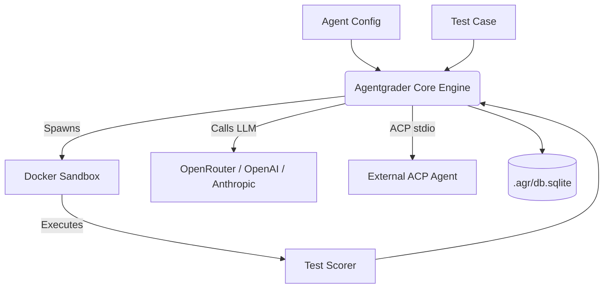

# What is Agentgrader?

**Agentgrader** is an open-source coding agent optimizer. Measure how your agent performs on real programming tasks, compare configs side by side, and iterate until solve rate, cost, and quality improve.

Install from npm or Bun. No repository clone required:

::: code-group

```bash [npm]
npm install -g agentgrader
```

```bash [bun]
bun add -g agentgrader
```

:::

The core loop is simple: **evaluate** one agent on one task (`agr run`), **compare** many agents across your suite (`agr bench`), then **optimize** with matrix sweeps, baselines, and CI gates until you land on a better config.

## Key features

- **Language-agnostic test cases:** Any language that runs in Docker: TypeScript, Python, Rust, Go, and more.
- **Real execution:** Agents run commands and edit files in a Docker container. No mocks.
- **Objective scoring:** Pass and fail are determined by running real test suites (`npm test`, `pytest`, etc.) and optional per-test regression checks.
- **Cost tracking:** Every run records tokens consumed and USD cost per model.
- **Config comparison:** Run full suites against multiple agent configs, sweep hyperparameters, and read Pareto summaries.
- **Pluggable adapters:** Swap the LLM adapter (`ai-sdk`), an external ACP agent (`acp`), sandbox provider, or scorers without changing core logic.
- **Node and Bun:** Runs on Node.js 18+ or [Bun](https://bun.sh/). Results persist in a local SQLite database.

## Architecture overview

Click the diagram to open the interactive viewer. Zoom with the mouse wheel, pan by dragging, or use the toolbar buttons.



You define agent configs and test cases. Agentgrader runs evaluations in isolated sandboxes, scores each attempt objectively, and stores results so you can compare configs and track improvement over time.

## Get started

Follow the [Quickstart](/guide/quickstart) to install the CLI and run your first evaluation in minutes.
