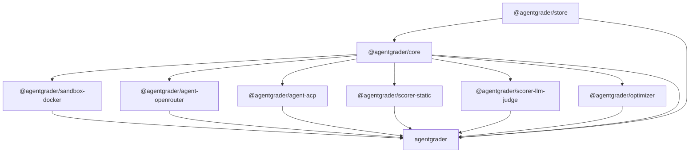

# Packages

Agentgrader is published as a set of npm packages. Install only what you need: most users only need the CLI; library integrators pull in `@agentgrader/core` and adapters directly.

## Architecture

Click any diagram to zoom and pan in the fullscreen viewer.



## Published packages

Current versions on npm (check `npm view <package> version` for the latest):

| Package | Role |
|---|---|
| [`agentgrader`](https://www.npmjs.com/package/agentgrader) | CLI binary (`agr`). Commands: `run`, `bench`, `validate`, `import-pr`, `trace`. |
| [`@agentgrader/core`](https://www.npmjs.com/package/@agentgrader/core) | Schemas, runner (`runSingle`, `runBenchmark`), scorers, validation. |
| [`@agentgrader/store`](https://www.npmjs.com/package/@agentgrader/store) | SQLite persistence (runs, traces, baselines) via Drizzle ORM. |
| [`@agentgrader/sandbox-docker`](https://www.npmjs.com/package/@agentgrader/sandbox-docker) | Default Docker sandbox provider. |
| [`@agentgrader/agent-openrouter`](https://www.npmjs.com/package/@agentgrader/agent-openrouter) | Default agent adapter (OpenRouter, OpenAI, Anthropic via AI SDK). |
| [`@agentgrader/agent-acp`](https://www.npmjs.com/package/@agentgrader/agent-acp) | ACP client adapter for external agents (Claude Code, Cursor Agent, etc.) over stdio. |
| [`@agentgrader/scorer-static`](https://www.npmjs.com/package/@agentgrader/scorer-static) | Additive quality scorer: diff size, lint, TODO markers. |
| [`@agentgrader/scorer-llm-judge`](https://www.npmjs.com/package/@agentgrader/scorer-llm-judge) | Additive LLM judge scorer (opt-in). |
| [`@agentgrader/optimizer`](https://www.npmjs.com/package/@agentgrader/optimizer) | Matrix expansion, aggregation, and Pareto front helpers for `agr bench --matrix`. |

## Typical installs

**CLI only** (evaluate agents from the terminal):

::: code-group

```bash [npm]
npm install -g agentgrader
```

```bash [bun]
bun add -g agentgrader
```

:::

**Programmatic integration** (custom pipelines, CI tools):

::: code-group

```bash [npm]
npm install @agentgrader/core @agentgrader/sandbox-docker @agentgrader/agent-openrouter @agentgrader/agent-acp @agentgrader/store
```

```bash [bun]
bun add @agentgrader/core @agentgrader/sandbox-docker @agentgrader/agent-openrouter @agentgrader/agent-acp @agentgrader/store
```

:::

See [Programmatic API](/advanced/programmatic-api) for usage examples.

## Package details

### `@agentgrader/store`

SQLite persistence layer. Stores run records, per-step traces, test case baselines, and cost telemetry. The CLI writes to `.agr/db.sqlite` in the working directory via `initDb()`.

### `@agentgrader/core`

Core engine: Zod schemas (`TestCase`, `AgentConfig`), `runSingle` / `runBenchmark` runners, and scorers (Command, Assertion, Regression, Diff, Localization). Depends on `@agentgrader/store`.

### `@agentgrader/sandbox-docker`

Default sandbox provider using local Docker containers. Manages container lifecycle, fixture copying, shell execution, and git diffs.

### `@agentgrader/agent-openrouter`

Default agent adapter. Routes to OpenRouter, OpenAI, or Anthropic based on `provider` in the agent config. Exports `AiSdkAgentAdapter` (with `OpenRouterAgentAdapter` as a backwards-compatible alias).

### `@agentgrader/agent-acp`

ACP client adapter. Spawns an ACP-compatible agent subprocess, negotiates over stdio with `@agentclientprotocol/sdk`, and routes filesystem/terminal tool calls into the sandbox. Exports `AcpAgentAdapter`. Select with `--adapter acp` or pass to `runBenchmark({ adapters: [...] })`. See [ACP Agent Adapter](/advanced/acp-agent).

### `@agentgrader/scorer-static`

Non-blocking quality scorer wired into `agr bench` by default. Annotates `metrics["static-quality"]` with diff lines, files modified, TODO markers, and Biome lint violations.

### `@agentgrader/scorer-llm-judge`

Optional non-blocking scorer that asks an LLM to rate the agent's diff. Annotates `metrics["llm-judge"]`. Degrades gracefully if the diff is empty or the judge call fails.

### `@agentgrader/optimizer`

Helpers behind `agr bench --matrix`: `expandMatrix()` generates the cartesian product of agent configs, `aggregateResults()` computes solve rate and cost per config, `paretoFront()` filters to Pareto-optimal configs.

### `agentgrader` (CLI)

Terminal CLI (`agr`) with Ink dashboard for benchmarks. Depends on all packages above. Loads `.env` from the current working directory for API keys.
